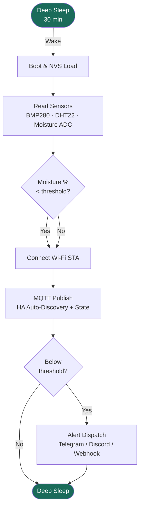

# ESP32-C3 Environmental Node

A battery-friendly environmental monitoring node built with **native ESP-IDF v5.x** and **PlatformIO** — no Arduino framework.

The firmware wakes from Deep Sleep, reads three sensors, evaluates a soil moisture threshold, dispatches alerts over any configured channel, publishes telemetry to Home Assistant via MQTT, then returns to sleep. A SoftAP web portal is available on-demand for zero-touch field configuration.

---

## Core Architecture



| Subsystem | Implementation | File |
|---|---|---|
| **Boot / operational loop** | `app_main()` orchestrates wake→sense→network→sleep | `src/main.c` |
| **Config persistence** | ESP-IDF NVS — survives Deep Sleep and firmware updates | `src/sys_nvs.c` |
| **SoftAP portal** | ESP-IDF HTTP server + vanilla HTML/JS, no external dependencies | `src/sys_wifi.c` |
| **Sensor HAL** | BMP280 (I²C forced mode), DHT22 (bit-bang), capacitive ADC | `src/hal_*.c` |
| **MQTT telemetry** | `esp-mqtt` — connects, publishes HA Auto-Discovery + state, disconnects | `src/sys_mqtt.c` |
| **Alert dispatch** | Independent Telegram Bot API, Discord Webhook, Custom Webhook | `src/sys_wifi.c` |

---

## Features

- :fontawesome-solid-moon: **Deep Sleep** between cycles — ESP32-C3 draws ~5 µA in sleep, enabling months of battery operation
- :fontawesome-solid-wifi: **SoftAP Configuration Portal** — hold `BOOT` (GPIO9) for 3 s at any time to launch; connect to `EnvNode-Setup` and open `http://192.168.4.1`
- :fontawesome-solid-database: **NVS Persistence** — all credentials and calibration values survive power cycles; no re-flashing needed
- :fontawesome-brands-telegram: **Multi-channel Alerts** — Telegram, Discord Webhook, and Custom Webhook; all optional and independent
- :fontawesome-solid-house-signal: **Home Assistant MQTT Auto-Discovery** — the node announces itself with six sensor entities on first boot; no manual HA configuration required
- :fontawesome-solid-sliders: **In-browser ADC Calibration** — set dry/wet mV reference points from the portal; no code changes needed

---

## Sensor Data Entities

The node publishes the following entities to Home Assistant over MQTT:

| Entity | HA Device Class | Unit | Topic |
|---|---|---|---|
| Soil Moisture | `moisture` | `%` | `<prefix>/soil_pct` |
| Soil Raw ADC | — | `mV` | `<prefix>/soil_mv` |
| Temperature (BMP280) | `temperature` | `°C` | `<prefix>/bmp_temp` |
| Pressure | `atmospheric_pressure` | `hPa` | `<prefix>/bmp_pressure` |
| Temperature (DHT22) | `temperature` | `°C` | `<prefix>/dht_temp` |
| Humidity | `humidity` | `%` | `<prefix>/dht_humidity` |

Default `<prefix>`: `d7main/sensor` (configurable in the portal).

---

## Quick Start

**Flash pre-built firmware** (no toolchain needed):

→ **[Open Web Flasher](flasher.md)** — works directly in Chrome or Edge.

**Build from source:**

```bash
git clone https://github.com/d7main/ESP32_EnvironmentalNode.git
cd ESP32_EnvironmentalNode
pio run --environment esp32_c3        # build
pio run --environment esp32_c3 --target upload  # flash
pio device monitor                     # serial monitor at 115200 baud
```

**First boot:**

1. The node detects it is unconfigured and launches the SoftAP portal automatically.
2. Connect to Wi-Fi SSID **`EnvNode-Setup`** (password: `configure`).
3. Open **`http://192.168.4.1`** in a browser.
4. Fill in your Wi-Fi credentials and any notification channels you want.
5. Click **Save & Reboot** — the device restarts and begins normal operation.

!!! tip "Re-entering the portal after first setup"
    Hold **GPIO9 (BOOT button)** for **3 seconds** at any point during an active cycle.
    The portal will relaunch immediately without reflashing.

---

## NVS Key Reference

All configuration is stored in the `config` NVS namespace. Keys are limited to 15 characters by ESP-IDF.

| NVS Key | Field | Max Length | Default |
|---|---|---|---|
| `ssid` | Wi-Fi SSID | 32 | — |
| `pass` | Wi-Fi Password | 64 | — |
| `tg_token` | Telegram Bot Token | 64 | `""` (disabled) |
| `tg_chat` | Telegram Chat ID | 32 | `""` |
| `disc_url` | Discord Webhook URL | 256 | `""` |
| `cust_url` | Custom Webhook URL | 256 | `""` |
| `mqtt_uri` | MQTT Broker Host / URI | 128 | `""` (disabled) |
| `mqtt_port` | MQTT Broker Port | u16 | `1883` |
| `mqtt_user` | MQTT Username | 64 | `""` |
| `mqtt_pass` | MQTT Password | 64 | `""` |
| `mqtt_prefix` | MQTT Topic Prefix | 64 | `d7main/sensor` |
| `v_dry` | Dry calibration (mV) | i16 | `0` |
| `v_wet` | Wet calibration (mV) | i16 | `0` |
| `soil_th_pct` | Alert threshold (%) | u8 | `30` |
| `conf` | Configured flag | u8 | `0` |

---

## License

[MIT](https://github.com/d7main/ESP32_EnvironmentalNode/blob/main/LICENSE) — free to use, modify, and distribute.
